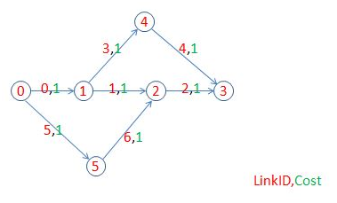
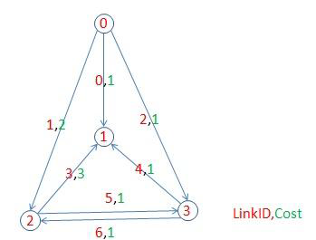

### 前言
赛题源自“未来网络”业务发放中的路由计算问题。算路问题属于基础算法问题，在图论、网络、交通等各个方面均有着广泛的研究与运用，里面不乏一些经典的算法，例如最短路中的广度优先搜索，Dijkstra算法等。网络算路问题的更优算法实现对于网络资源高效配置具有重要价值。

本次大赛分为初赛、复赛和总决赛三个主要阶段，当前为复赛阶段。

### 复赛赛题描述

#### 1 问题定义

给定一个带权重的有向图G=(V,E)，V为顶点集，E为有向边集，每一条有向边均有一个权重。对于给定的顶点s、t，以及V的子集V’和V’’，寻找从s到t的两条不成环的有向路径P’和P’’，使得P’经过V’中所有的顶点，而P’’经过V’’中所有的顶点（对P’经过V’中顶点的顺序以及P’’经过V’’中顶点的顺序不做要求）。

若不同时存在这样的两条有向路径，则输出无解，程序运行时间越短，则视为结果越优； 若同时存在这样的两条有向路径，则输出得到的两条路径，按下列优先级从高到低评价结果优劣：

1. 路径P’和P’’重合的有向边个数越少，则视为结果越优；  
2. 在两条路径重合的有向边个数一样的情况下，两条路径权重总和越少，则视为结果越优；  
3. 在上述两个指标一样的情况下，程序运行时间越短，则视为结果越优。  

说明：

1. 图中所有权重均为[1,100]内的整数；  
2. 任一有向边的起点不等于终点；  
3. 连接顶点A至顶点B的有向边可能超过一条，其权重可能一样，也可能不一样；  
4. 该有向图的顶点不会超过2000个，每个顶点出度（以该点为起点的有向边的数量）不超过20；  
5. V’和V’’中元素个数均不超过100，交集为空，且不包含起始顶点s和终止顶点t；  
6. 从s到t的不成环有向路径P是指，P为由一系列有向边组成的从s至t的有向连通路径，且不允许重复经过任一顶点；  
7. 路径的权重是指所有组成该路径的所有有向边的权重之和（重复边的权重应分别在两条路径中各计算一次）。  

#### 2 输入与输出

##### 输入文件格式

以两个.csv文件（csv是以逗号为分隔符的文本文件）给出输入数据，一个为图的数据(G)，一个为需要计算的路径信息(s,t,V’,V’’)。文件每行以换行符（ASCII’\n’即0x0a）为结尾。

1）图的数据中，每一行包含如下的信息：

LinkID,SourceID,DestinationID,Cost

其中，LinkID为该有向边的索引，SourceID为该有向边的起始顶点的索引，DestinationID为该有向边的终止顶点的索引，Cost为该有向边的权重。顶点与有向边的索引均从0开始编号(不一定连续，但用例保证索引不重复)，顶点索引范围在[0，2000)，有向边索引范围在[0，40000)。

2）路径信息中，只有一行如下数据：

DemandID,SourceID,DestinationID,IncludingSet
其中，DemandID里面第一行为1，第二行为2，表示路径索引，1表示P’，2表示P’’，SourceID为起始顶点s的索引，DestinationID为终止顶点t的索引，IncludingSet表示必须经过的顶点集合V’或V’’，其中不同的顶点索引之间用“ | ”分割，如果该路径没有必经顶点要求，则此处输入NA。

##### 输出文件格式

输出文件同样为一个.csv 文件。

1）如果该测试用例存在满足要求的有向路径P’和P’’，则输出两行信息，第一行按P’经过的有向边顺序，依次输出有向边的索引，索引之间用“ | ”分割；第二行按P’’经过的有向边顺序依次输出有向边的索引，索引之间用“ | ”分割；

2）如果该测试用例不同时存在两条满足要求的有向路径P’和P’’，则只输出一行信息：NA；

3）每一行只允许输出最多一条有向路径，以换行符0x0a结尾。

#### 3 单个用例的评分机制

##### 有解用例的排名机制

按下面流程对参赛者结果进行排名：

Step1： 对于提交的结果，进行合法性检验(详见题目描述)；

Step2： 程序运行时间不得超过10s；

若不满足上述的结果则本用例得分为0；

Step3： 路径P’和P’’重合的有向边个数（不考虑权重）越少，排名越优；

Step4： 在路径P’和P’’重合的有向边个数一样的情况下，计算P’和P’’的权重和，权重越小，排名越优；

Step5： 在上述两个指标一样的情况下，用程序运行时间细化排名，时间越短，排名越优。

##### 无解用例的排名机制

按下列流程对参赛者结果进行排名：

Step1： 对于提交的结果，验证是否识别出该用例无解，若无法识别或者程序运行时间超10s，则本用例得分为0；

Step2： 用程序的运行时间进行排名，时间越短，排名越优。

单个用例的评分标准如下：

根据上面排名流程得到的排名，使用标准分计分(排名第一的提交者为100分)。

若所有人均未得到正确结果，则所有人均得分为0。

#### 4 网站系统判分机制

复赛阶段官方网站开放接收复赛程序提交，系统平台会使用N个测试用例在线判题，参赛者对于每个测试用例都会得到一个百分制分数，使用算术平均分为该参赛者的最终得分，并展示在各区域复赛排行榜中。
特别说明：复赛阶段的在线判题评分及排行仅供参赛者参考，不纳入最终复赛成绩。

#### 5 简单用例说明

在如上图所示的有向图中，我们会得到下面的有向图信息：

0,0,1,1  
1,1,2,1  
2,2,3,1  
3,1,4,1  
4,4,3,1  
5,0,5,1  
6,5,2,1  

如果此时需要寻找从0到3的路径P’和P’’，且P’必须经过顶点1，P’’必须经过顶点2，相应的路径信息文件内容为：

1,0,3,1  
2,0,3,2  

对于该用例，可以找到如下两组解:

0|1|2  
5|6|2  

以及

0|3|4  
5|6|2  

由于第一组解两条路径的重合边个数为1，第二组解两条路径的重合边个数为0。所以此时最优解应该是0|3|4，5|6|2。

#### 6 复赛赛制说明

各区域晋级复赛队伍为32-36队，复赛采用分区域现场竞赛的形式开展，共分成三个小阶段：  
1. 排位赛：区域现场复赛当天，各区域将通过一个官方用例对进入复赛队伍提交的程序进行判题评分并排序，排序前8名的队伍将作为下一个阶段分组赛8个小组的种子队，其余队伍通过抽签方式进行分组。  
2. 分组赛：区域共分8个小组，各小组采用单循环对战方式竞赛，通过积分（每场比赛胜得3分，平各得1分，负得0分）进行小组排序，排序前2名的队伍小组出线进入下一阶段的淘汰晋级赛。  
3. 淘汰晋级赛：各小组出线队伍组成16强，分成上下半区进行两两对战淘汰晋级赛，分为“1/8决赛→1/4决赛→半决赛→决赛”，最后决出区域4强进入全国总决赛。  

两队对战规则说明：  
1. 复赛分组赛和淘汰晋级赛均采用两队对战的形式，每场对战9局5胜。（分组赛胜积3分，负积0分，平各积1分，最后排序积分相同情况下，排位赛成绩靠前者胜出；淘汰赛出现平局，则由官方提供用例“加时赛”决出胜负）；  
2. 对战双方（如红方、蓝方）各需提供2个自设计用例，官方提供5个用例，共9个用例分9局进行对战，用例发放顺序为：红方1→蓝方1→红方2→蓝方2→官方1→官方2→官方3→官方4→官方5；  
3. 每局对战中，如由于己方提供用例导致自己计算不出，则该局对方自动胜出，其余依据“单个用例评分机制”判定胜负。  

#### 7 关于参赛队自行生成对战测试用例的说明

由官方在复赛阶段提供若干完整用例作为选手生成用例的素材，选手可自行编辑用例（如删增顶点、有向边、必经顶点、修改起始终止顶点等），或完全自行设计用例，只需保证用例符合题目要求且有解。官方将通过大赛网站给进入复赛的参赛队开放用例设计工具。

#### 8 复赛注意事项
1. 核心算法禁止使用第三方代码；
2. 如参考有论文或第三方代码，必须在readme文件中提供来源说明；
3. 针对所有用例必须使用同一个算法和同一套代码实现。

---

### 初赛赛题描述
#### 1 问题定义

给定一个带权重的有向图G=(V,E)，V为顶点集，E为有向边集，每一条有向边均有一个权重。对于给定的顶点s、t，以及V的子集V'，寻找从s到t的不成环有向路径P，使得P经过V'中所有的顶点(对经过V'中节点的顺序不做要求)。

若不存在这样的有向路径P，则输出无解，程序运行时间越短，则视为结果越优；若存在这样的有向路径P，则输出所得到的路径，路径的权重越小，则视为结果越优，在输出路径权重一样的前提下，程序运行时间越短，则视为结果越优。

说明：  
1. 图中所有权重均为[1，20]内的整数；  
2. 任一有向边的起点不等于终点；  
3. 连接顶点A至顶点B的有向边可能超过一条，其权重可能一样，也可能不一样；  
4. 该有向图的顶点不会超过600个，每个顶点出度(以该点为起点的有向边的数量)不超过8；  
5. V'中元素个数不超过50；  
6. 从s到t的不成环有向路径P是指，P为由一系列有向边组成的从s至t的有向连通路径，且不允许重复经过任一节点；  
7. 路径的权重是指所有组成该路径的所有有向边的权重之和。  

#### 2 输入与输出

##### 输入文件格式

以两个.csv 文件(csv 是以逗号为分隔符的文本文件)给出输入数据，一个为图的数据(G)，一个为需要计算的路径信息(s,t,V')。文件每行以换行符(ASCII'\n'即0x0a)为结尾。

1）图的数据中，每一行包含如下的信息：

LinkID,SourceID,DestinationID,Cost

其中，LinkID 为该有向边的索引，SourceID 为该有向边的起始顶点的索引，DestinationID为该有向边的终止顶点的索引，Cost 为该有向边的权重。顶点与有向边的索引均从0 开始 编号(不一定连续，但用例保证索引不重复)。

2）路径信息中，只有一行如下数据：

SourceID,DestinationID,IncludingSet

其中，SourceID 为该路径的起点，DestinationID 为该路径的终点，IncludingSet 表示必须经过的顶点集合V'，其中不同的顶点索引之间用'|'分割。

##### 输出文件格式

输出文件同样为一个.csv 文件。  
1. 如果该测试用例存在满足要求的有向路径P，则按P 经过的有向边顺序，依次输出有向边的索引，索引之间用'|'分割；  
2. 如果该测试用例不存在满足要求的有向路径P，则输出两个字符NA；  
3. 只允许输出最多一条有向路径。  

#### 3 单个用例的评分机制

##### 有解用例的排名机制

按下面流程对参赛者结果进行排名：

Step1： 对于提交的结果，进行合法性检验(详见题目描述)；

Step2： 程序运行时间不得超过10s；

若不满足上述的结果则本用例得分为0；

Step3： 计算提交的路径的权重，权重越小，排名越优；

Step4： 在权重相同的结果里，用程序运行时间进行排名，时间越短，排名越优。

##### 无解用例的排名机制

按下列流程对参赛者结果进行排名：

Step1： 对于提交的结果，验证是否识别出该用例无解，若无法识别或者算法运行时间超10s，则本用例得分为0；

Step2： 用程序的运行时间进行排名，时间越短，排名越优。

单个用例的评分标准如下：

根据上面排名流程得到的排名，使用标准分计分(排名第一的提交者为100分)。

若所有人均未得到正确结果，则所有人均得分为0。

#### 4 最终得分机制

平台会使用N个测试用例判题，该N个测试用例分为初级、中级、高级三个等级，参赛者对于每个测试用例都会得到一个百分制分数，使用加权平均分(初级权重为0.2，中级权重为0.3，高级权重为0.5)作为该参赛者的最终得分。

特别说明：在比赛初期，平台只放出初级、中级的测试用例，故此时满分为50分，在比赛后期，才会放出高级测试用例（具体发放时间会在网站公告通知），此时满分才为100分，请各位参赛者注意。

#### 5 简单用例说明

在如上图所示的有向图中，我们会得到下面的有向图信息：

0,0,1,1  
1,0,2,2  
2,0,3,1  
3,2,1,3  
4,3,1,1  
5,2,3,1  
6,3,2,1  

如果此时需要寻找从0到1的路径，且必须经过顶点2和3，我们会得到如下的路径信息：

0,1,2|3  

对于该用例，可以找到如下两条可行路径:

1|5|4  
2|6|3  

由于第一条路径的权重为4，第二条路径的权重为5，所以此时最优解应该1|5|4。

### 运行环境

CPU：Intel Xeon CPU E5-2690 V2 @ 3.00GHz  
内存：2G  
内核：单核  
编译器：gcc 4.8.4；java 1.7.0_95；  
操作系统：linux Ubuntu 14.04.3 LTS 64位，内核版本 Linux version 3.13.0-24-gineric  
SDK：为方便选手做题，分别提供c++(兼容c）和Java SDK包供参考（见赛题下载包），详细描述信息请见SDK目录下的readme.txt。  

### 讨论交流

武长赛区QQ群 117280759  
杭厦赛区QQ群 131946455  
上合赛区QQ群 221036348  
粤港澳赛区QQ群 493667385  
西北赛区QQ群 389603273  
南京苏州赛区QQ群 545377507  
京津东北赛区QQ群 271699173  
成渝赛区QQ群 537141027  
